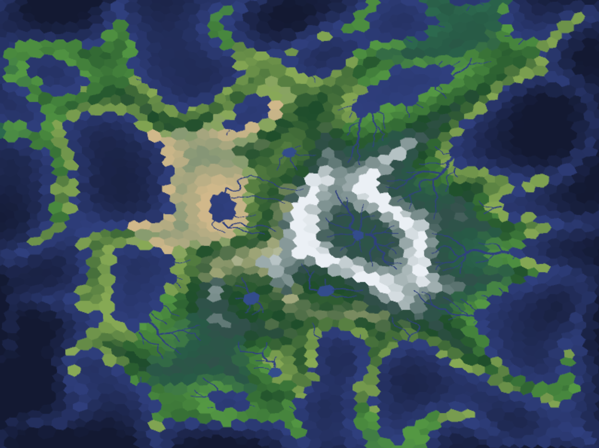

# Voronoi Terrain Generator

A real-time procedural 2D island and terrain map generator written in **Rust** using **Macroquad** and **Delaunator**.

This application generates island topographies using Delaunay triangulation and Voronoi dual-mesh structures. It features ridged multifractal noise elevation, elevation-aware moisture distribution, dynamic river accumulation with organic noise-curved paths, inland lake formation, and multi-tiered biome shading.


---

## Features

- **Dual-Mesh Topology**: Delaunay triangulation converted into Voronoi cell regions and centroids.
- **Ridged Multifractal Elevation**: Combines low-frequency Simplex noise for island landmasses with $(1.0 - |N(x, y)|)^2$ ridged noise to form razor-thin, branching mountain crests and alpine valleys.
- **Elevation-Aware Moisture**: Simplex noise moisture modified by elevation gradients to simulate orographic precipitation on mountain ranges.
- **Stratified Biome Palette**: 
  - **Lowlands**: Subtropical Deserts, Grasslands/Prairies, Deciduous Forests, and Tropical Rainforests.
  - **Highlands**: Shrubland and Dark Coniferous Pine Forests (Taiga).
  - **Alpine**: Barren Slate Rock/Scree, Alpine Tundra, and Alpine Scrub.
  - **Summits**: Glacier Snow Caps.
- **Hydrological Flow & Inland Lakes**:
  - Downslope graph calculation for downhill river accumulation.
  - Automatic inland lake formation at local elevation sinks where rivers terminate.
  - Natural river pathing with noise-driven perpendicular meanders and smooth endpoint clamping.
- **Boundary Distortion Fix**: Edge margin padding rendered via Macroquad `Camera2D` to eliminate Voronoi convex hull distortion.

---

## Interactive Controls

| Key | Action | Description |
| :--- | :--- | :--- |
| `R` | **Randomize Seed** | Generates a new pseudo-random map seed and recalculates terrain. |
| `Left` / `Right` | **Adjust Elevation Offset** | **Right Arrow** raises global terrain elevation (expands landmass & mountains). **Left Arrow** lowers elevation (submerges lowlands into ocean). |
| `Up` / `Down` | **Adjust River Threshold** | **Up Arrow** increases flow threshold (displays only major rivers). **Down Arrow** decreases threshold (displays smaller tributary streams). |
| `L` | **Toggle Cell Boundaries** | Shows or hides black Voronoi cell boundary lines. |
| `P` | **Toggle Sample Points** | Shows or hides red Delaunay generator points. |
| `I` | **Toggle On-Screen HUD** | Shows or hides the on-screen UI overlay text. |

---

## Running the Application

### Prerequisites
- [Rust & Cargo](https://www.rust-lang.org/) installed.

### Build and Run

```bash
# Debug mode
cargo run

# Optimized release mode
cargo run --release
```

---

## Attribution & Acknowledgments

This project is inspired by and based on the Voronoi terrain generation algorithms developed by **Amit Patel** at **Red Blob Games**:

- [Red Blob Games: Voronoi Maps Tutorial](https://www.redblobgames.com/x/2022-voronoi-maps-tutorial/)
- [JavaScript Reference Source (`voronoi-maps-tutorial.js`)](https://www.redblobgames.com/x/2022-voronoi-maps-tutorial/voronoi-maps-tutorial.js)
